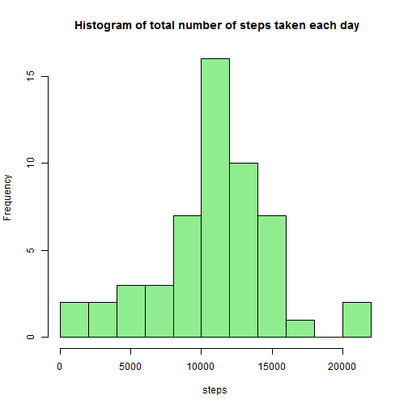
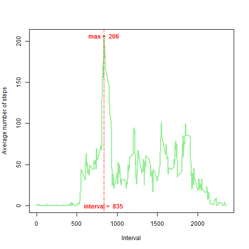
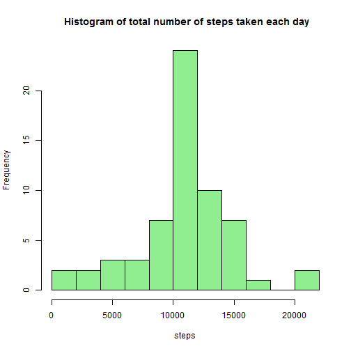
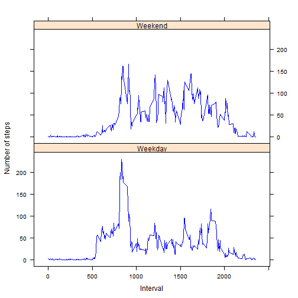

This assignment makes use of data from a personal activity monitoring device. This device collects data at 5 minute intervals through out the day. The data consists of two months of data from an anonymous individual collected during the months of October and November, 2012 and include the number of steps taken in 5 minute intervals each day.

Data file: [activity.csv](https://raw.githubusercontent.com/dt-scientist/RepData_PeerAssessment1/master/activity.zip)


**Loading and preprocessing the data**


```r
data <- read.csv("C:/Users/geo/Documents/DS/Reproducible research/activity/activity.csv", colClasses=c(steps="numeric",date="Date", interval="numeric"))
```

**What is mean total number of steps taken per day?**

For this part of the assignment, you can ignore the missing values in the dataset.

1. Make a histogram of the total number of steps taken each day


```r
total_steps_per_day<-aggregate(list(steps=data$steps), by =list(date=data$date), sum)
hist(total_steps_per_day$steps, breaks = 10,xlab="steps", 
     main=" Histogram of total number of steps taken each day", 
     col="lightgreen")
```

 

2. Calculate and report the **mean** and **median** total number of steps taken per day


```r
mn<-format(mean(total_steps_per_day$steps,na.rm=TRUE),digits=2, nsmall=2)
md<-format(median(total_steps_per_day$steps,na.rm=TRUE),digits=2, nsmall=2)
```

The **mean** total number of steps taken per day is **10766.19**.
The **median** total number of steps taken per day is **10765.00**.


**What is the average daily activity pattern?**

1. Make a time series plot (i.e. type = "l") of the 5-minute interval (x-axis) and the average number of steps taken, averaged across all days (y-axis)


```r
steps_by_int<-aggregate(list(steps=data$steps), by =list(interval=data$interval), mean,na.rm=TRUE, na.action=NULL)
plot(steps_by_int$interval, steps_by_int$steps, type="l", xlab= "Interval", 
     ylab= "Average number of steps",
     col="lightgreen" , lwd=2)
abline(v=steps_by_int[which.max(steps_by_int$steps),][1], lty=4, col="red")  
text(steps_by_int[which.max(steps_by_int$steps),][1],max(steps_by_int$steps),font=2, col="red",  
     labels=paste("max = ",as.character(round(max(steps_by_int$steps)))))        
text(steps_by_int[which.max(steps_by_int$steps),][1],min(steps_by_int$steps),font=2, col="red", 
     labels=paste("interval = ",as.character(round(steps_by_int[which.max(steps_by_int$steps),][1]))))
```

 

2. Which 5-minute interval, on average across all the days in the dataset, contains the maximum number of steps?


```r
interval_max_steps<-steps_by_int[steps_by_int$steps==max(steps_by_int$steps),]
```

Interval **835** contains the maximum number of steps (**206**).

**Imputing missing values**

Note that there are a number of days/intervals where there are missing values (coded as NA). The presence of missing days may introduce bias into some calculations or summaries of the data.

1. Calculate and report the total number of missing values in the dataset (i.e. the total number of rows with NAs)


```r
row.has.na <- apply(data, 1, function(x){any(is.na(x))})
countNAs<-sum(row.has.na)
```

The total number of missing values in the dataset is **2304**


2. Devise a strategy for filling in all of the missing values in the dataset. The strategy does not need to be sophisticated. For example, you could use the mean/median for that day, or the mean for that 5-minute interval, etc.

I will calculate the **mean for each 5-minute interval** and then substitute each **"NA"** by the group mean of which the **"NA"** is belonging to. 

3. Create a new dataset that is equal to the original dataset but with the missing data filled in.


```r
cleandata<-data
cleandata$steps[is.na(cleandata$steps)] <- ave(cleandata$steps,
                                 cleandata$interval,
                                 FUN=function(x)mean(x,
                                                     na.rm = T))[is.na(cleandata$steps)]
countNAs<-sum( is.na( cleandata$steps ) )
```

The total number of missing values in the **new** dataset is **0**


4. Make a histogram of the total number of steps taken each day and Calculate and report the mean and median total number of steps taken per day. Do these values differ from the estimates from the first part of the assignment? What is the impact of imputing missing data on the estimates of the total daily number of steps?


```r
total_steps_per_day<-aggregate(list(steps=cleandata$steps), by =list(date=cleandata$date), sum)
hist(total_steps_per_day$steps, breaks = 10,xlab="steps", 
     main=" Histogram of total number of steps taken each day", 
     col="lightgreen")
```

 


```r
mnNoNAs<-format(mean(total_steps_per_day$steps,na.rm=TRUE),digits=2, nsmall=2)
mdNoNAs<-format(median(total_steps_per_day$steps,na.rm=TRUE),digits=2, nsmall=2)
```

The **mean** total number of steps taken per day is **10766.19**.
The **median** total number of steps taken per day is **10766.19**.

The mean and median values do not differ from the estimates from the first part of the assignment.The frequencies, as depicted by the height of a rectangular bars located directly above the corresponding interval,have changed after filling missing values.


**Are there differences in activity patterns between weekdays and weekends?**

1. Create a new factor variable in the dataset with two levels - "weekday" and "weekend" indicating whether a given date is a weekday or weekend day.


```r
cleandata$wend <- as.factor(ifelse(weekdays( cleandata$date) %in% c("Saturday","Sunday"), "Weekend", "Weekday")) 
```


2. Make a panel plot containing a time series plot (i.e. type = "l") of the 5-minute interval (x-axis) and the average number of steps taken, averaged across all weekday days or weekend days (y-axis).

```r
library(lattice)
steps_by_int<-aggregate(list(steps=cleandata$steps), by =list(interval=cleandata$interval,daytype=cleandata$wend), mean,na.rm=TRUE, na.action=NULL)
xyplot(steps ~ interval | daytype, data=steps_by_int,pch=1,type='l',layout=c(1,2)
       ,col="blue",xlab="Interval", ylab = "Number of steps")
```

 
